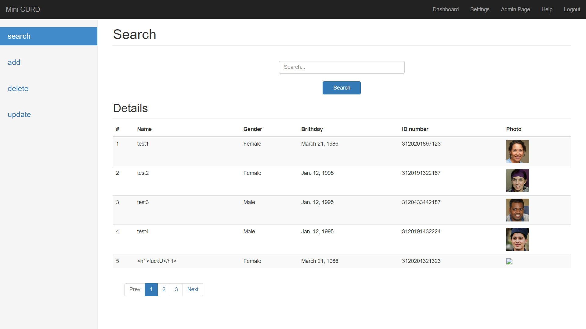
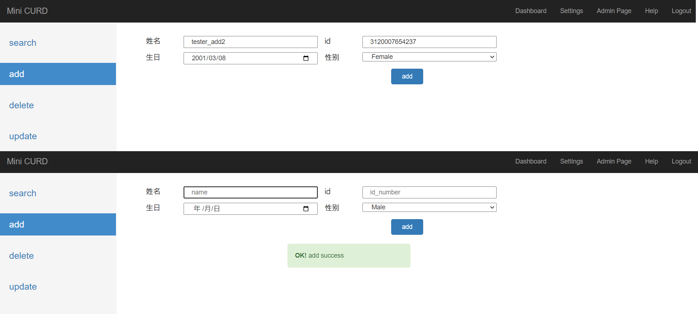

# MINI_CURD

一个基础的 Django 自用小型框架，主要实现的功能就是对数据的 **增删查改** + **登录框**

不采用前后端分离设计，数据库使用mysql

## login

## index

### search

## add

### singel add

## TODO

- 前端
    - [x] `login.html`
    - [x] `index.html`
    - [x] `bootstrap/CSS/JS/JQuery`
- 后端
    - [x] ORM Model
    - [x] login form
    - **CURDs**
        - [ ] Create
         - [x] 单个对象添加
         - [ ] 头像上传
         - [ ] excel批量上传
        - [ ] Update
        - [ ] Search (Doing)
          - [x] Search 使用Jquery Ajax 局部刷新分页
          - [x] 搜索结果下标
          - [ ] 模糊搜索算法 `app_curd\untils\fuzz_search.py`
        - [ ] Delete
- 文档
    - `login`

        使用django自带的auth进行验证

        如果已经登陆则重定向到 `index`

        - DTL相关
            - 网页表头 `name`
        - 提交的参数 
            使用django form组件，位于 `app_curd\forms.py`中

    - `index` 
        - DTL相关
            - 查询使用秒数 `seconds`
            - 返回的结果总数 `counts`
            - 返回地对象 `objs`
        - 提交的参数
            - 模糊查询语句 `query`

- 数据库